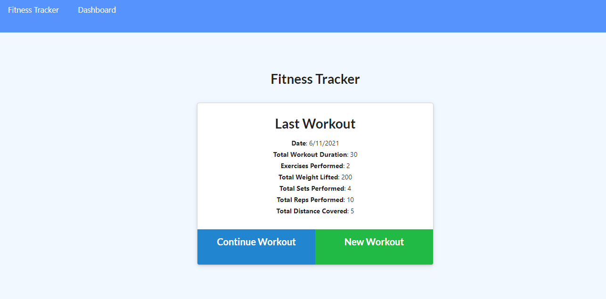
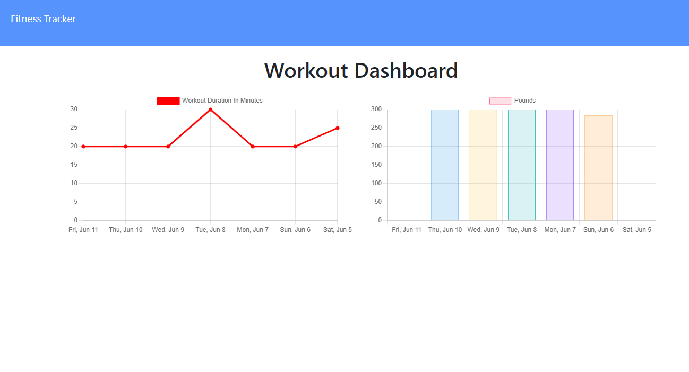

# Workout Tracker

## Description

Do you want to get in shape and live a healthier life?

This workout tracker will allow you to log multiple exercises in a workout on a given day. You can view up to seven days worth of workouts. You can track your resistance and cardio exercises, too. All you need to do is track the name, type, weight, sets, reps, and duration. If you're doing cardio, then you'll also be given the ability to track distance traveled. Weight, sets, reps, and distance are optional entries in case you do or don't need them.

Get ready to be in the best shape of your life!

This workout tracker was written in JavaScript using Express.js, Mongoose, Node.js, MongoDB Atlas, HTML, and CSS. It's deployed on Heroku.

## Table of Contents

* [Description](#description)
* [Installation](#installation)
* [Usage](#usage)
* [Credits](#credits)
* [License](#license)

## Installation

To install the application's dependencies, type the following:
```md
npm install
```
To run seed the database, type: 
```md
npm run seed
```
To run the server, type the following:
```md
npm start
```
Once those steps are done, you can view the application in your browser using localhost:3005.

## Usage



Navigate to [Sarah Mäkelä's Workout Tracker](https://frozen-anchorage-27658.herokuapp.com/) and view the web page.

* Once you're there, view your previous workout data.
* Click New Workout to add a new exercise.
* Pick a type of exercise.
* Input the entries you need like name, weight, sets, reps, duration, and/or distance.
* View your Last Workout data.



## Credits

Created by [Sarah Mäkelä](https://github.com/smakela13).

## License

This website currently has No License, which means it is under exclusive copyright. No one can copy, distribute, or modify this website without permission.
